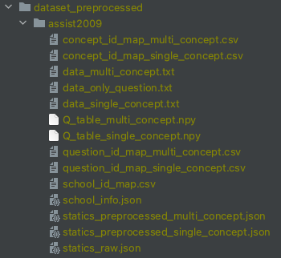

# 一、数据

## 1、数据格式

|                     | multi_concept | single_concept | only_question |
| ------------------- | ------------- | -------------- | ------------- |
| 单知识点数据集      | no            | yes            | no            |
| 多知识点数据集      | yes           | yes            | yes           |
| 无知识点/习题数据集 | no            | no             | yes           |
| 时间信息            | no            | yes            | yes           |

- `multi_concept` 对于多知识点数据集，将一道多知识点习题拆成多个单知识习题
- `single_concept` 对于单知识点数据集，即习题序列和知识点序列一一对应；对于多知识点数据集，将多知识点组合视为新知识点，则数据集转换为单知识点数据集
- `only_question` 只有习题序列，对于无知识点或者无习题数据集，都将其视为习题序列

## 2、数据集信息

- 单知识点数据集：`assist2012` `assist2017` `edi2020` `SLP` `slepemapy`

  - `edi2020`是层级知识点，且最低一级都是单知识点。只使用最细粒度的知识点，所以算单知识点数据集

- 多知识点数据集：`assist2009` `assist2009-new` `ednet-kt1` `xes3g5m`

  - `assist2009-new`是最新版本（从数据源网站可以获取）

  - 对于多知识点数据集，如果知识点不是层级的，则会有两种预处理，分别产生`multi_concept`和`single_concept`；多知识点数据集的`only_question`是对应`multi_concept`的，只是没有拆分习题，因为不用知识点序列

  - `xes3g5m`的知识点是层级的，但是最细粒度的知识点是多个的，所以当成多知识点数据集处理

  - 下面是`xes3g5m`的一个例子

    ```
    习题1035
    在question metadata中对应的kc_routes为
    [
      '拓展思维----应用题模块----年龄问题----年龄问题基本关系----年龄差', 
      '能力----运算求解',
      '课内题型----综合与实践----应用题----倍数问题----已知两量之间倍数关系和两量之差，求两个量',
      '学习能力----七大能力----运算求解',
      '拓展思维----应用题模块----年龄问题----年龄问题基本关系----年龄问题基本关系和差问题',
      '课内知识点----数与运算----数的运算的实际应用（应用题）----整数的简单实际问题----除法的实际应用',
      '知识点----应用题----和差倍应用题----已知两量之间倍数关系和两量之差，求两个量',
      '知识点----数的运算----估算与简单应用----整数的简单实际问题----除法的实际应用'
    ]
    在数据中对应的知识点为[169, 177, 239, 200, 73]，其对应的知识点名称为[
      '除法的实际应用', 
      '已知两量之间倍数关系和两量之差，求两个量', 
      '年龄差', 
      '年龄问题基本关系和差问题', 
      '运算求解'
    ]
    ```

- 无知识点/习题数据集：`assist2015` `statics2011`

## 3、初始化项目

- 修改`example/settings.json`中的配置，`LIB_PATH`是所有需要文件的根目录，`FILE_MANAGER_ROOT`是`lib`所在目录，然后运行`example/set_up.py`会生成所需要的目录

- 生成的目录结构如下所示，原始数据放到 ``LIB_PATH/lab/dataset_raw`` 下

  <div align=center></div>

- `ednet-kt1`因为原始数据文件太多，所以先使用`exampe/concat_ednet.py`将每5000名学生的记录合成一个文件，合成后的文件会放到`dataset_raw/ednet-kt1`下，其目录为：

  <div align=center></div>

- 运行 ``example/preprocess``处理对应的数据集（即`dataset_preprocessed`下的目录名），生成的数据在 ``数据存放地址/lab/dataset_preprocessed``

## 4、预处理生成的文件

- 以3个数据集为例

- `assist2009`：多知识点数据集

  <div align=center></div>

  - `concpet_id_map_[data_type].csv` 对应数据类型的知识点id映射文件，包括以下字段

    - `concept_id` 原始文件中知识点的id，为整数。注意：如果是原始文件中知识点id是数字，就和原始文件一样；如果不是数字，就先映射为整数再做预处理
    - `concept_mapped_id` 处理后的数据中知识点的id，从0开始

  - `data_[data_type].txt` 对应数据类型的处理完成的数据。第一行数据是所有信息，分成两类，用`;`分隔：前面的是学生/序列的属性，如学生id，序列长度，学生学校id；后面的是序列的id，如`question_seq`表示学生做题的习题序列，`concept_seq`表示学生做题对应的知识点序列，`correct_seq`表示学生做题的结果序列（0或1表示错误或正确），`time_seq`表示学生做题的时间戳序列，`use_time_seq`表示学生做题所用时间序列。具体例子如下

    - `multi_concept` `question_seq`中出现-1表示当前知识点和前一知识点是同一习题

    <div align=center></div>

    - `single_concept` 因为都是单知识点，所以`question_seq`中不会出现-1

    <div align=center></div>

    - `only_question` 只有习题序列，所以序列长度比`multi_concept`短

    <div align=center></div>

## 5、数据处理

- 数据处理分为两步
  - 数据预处理：包括丢弃信息缺失的交互（如习题、知识点缺少的交互），习题和知识点id的重映射，时间信息（做题时间、做题用时）等
  - 数据集划分处理：包括固定序列的长度、丢弃部分习题和知识点（如练习次数少于30次的习题）、数据集的划分（训练集、验证集、测试集）等
- 整个数据处理的pipline如下

## 6、提供的数据处理

- pykt
- cl4kt
- dimkt