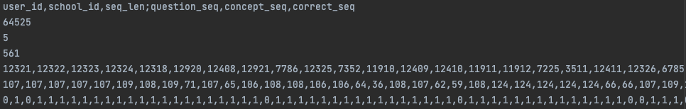

# 一、数据

## 1、数据格式

|                     | multi_concept | single_concept | only_question |
| ------------------- | ------------- | -------------- | ------------- |
| 单知识点数据集      | no            | yes            | no            |
| 多知识点数据集      | yes           | yes            | yes           |
| 无知识点/习题数据集 | no            | no             | ye            |

- `multi_concept` 对于多知识点数据集，将一道多知识点习题拆成多个单知识习题
- `single_concept` 对于单知识点数据集，即习题序列和知识点序列一一对应；对于多知识点数据集，将多知识点组合视为新知识点，则数据集转换为单知识点数据集
- `only_question` 只有习题序列，对于无知识点或者无习题数据集，都将其视为习题序列
- 为什么要处理为多种数据格式？
  - 有些方法默认习题和知识点是一一对应的，如`AKT`、`DIMKT`，这些方法需要处理为`multi_concept`或者`single_concept`
  - 有些方法对于多知识点习题，是将其多个对应知识点的embedding取平均，然后和习题embedding一起送入encoder，如`IEKT`、`LPKT`、`AKT`（论文`table 6`汇报的结果），这些方法就需要处理为`only_question`数据格式

## 2、数据集信息

- 单知识点数据集：`assist2012` `assist2017` `edi2020` `SLP` `slepemapy`

  - `edi2020`是层级知识点，且最低一级都是单知识点。只使用最细粒度的知识点，所以算单知识点数据集
  - 单知识点数据只会生成预处理数据：`data_single_concept.txt`

- 多知识点数据集：`assist2009` `assist2009-full` `ednet-kt1` `xes3g5m` `kdd cup2010`

  - `kdd cup2010`是一系列数据集，包括`algebra[2005|2006|2008]`和`bridge2algebra[2006|2008]`

  - `assist2009-full`是`assist2009`的完整版本，数据量更大

  - 对于多知识点数据集，会生成3种预处理数据：`data_multi_concept.txt`、`data_single_concept.txt`和`data_only_question.txt`

  - 注意：`xes3g5m`的知识点是层级的，但是最细粒度的知识点是多个的，所以当成多知识点数据集处理。`xes3g5m`的一个例子
  
    ```
    习题1035
    在question metadata中对应的kc_routes为
    [
      '拓展思维----应用题模块----年龄问题----年龄问题基本关系----年龄差', 
      '能力----运算求解',
      '课内题型----综合与实践----应用题----倍数问题----已知两量之间倍数关系和两量之差，求两个量',
      '学习能力----七大能力----运算求解',
      '拓展思维----应用题模块----年龄问题----年龄问题基本关系----年龄问题基本关系和差问题',
      '课内知识点----数与运算----数的运算的实际应用（应用题）----整数的简单实际问题----除法的实际应用',
      '知识点----应用题----和差倍应用题----已知两量之间倍数关系和两量之差，求两个量',
      '知识点----数的运算----估算与简单应用----整数的简单实际问题----除法的实际应用'
    ]
    在数据中对应的知识点为[169, 177, 239, 200, 73]，其对应的知识点名称为[
      '除法的实际应用', 
      '已知两量之间倍数关系和两量之差，求两个量', 
      '年龄差', 
      '年龄问题基本关系和差问题', 
      '运算求解'
    ]
    ```
  
- 无知识点/习题数据集：`assist2015` `statics2011`

  - 无知识点/习题数据只会生成预处理数据：`data_only_question.txt`


## 3、初始化项目

- 按照`README.md`中`Quick-Start`操作，生成的目录结构如下，原始数据放到 `lab/dataset_raw` 下

  <div align=center></div>

- `ednet-kt1`因为原始数据文件太多，所以先使用`exampe/concat_ednet.py`将每5000名学生的记录合成一个文件（通常情况下做`ednet-kt1`的实验也是随机选5000名学生的记录），合成后的文件会放到`dataset_raw/ednet-kt1`下，其目录为：

  <div align=center></div>

- 运行 `example/preprocess`处理指定数据集（即`dataset_preprocessed`下的目录名），生成的数据在 `lab/dataset_preprocessed`

## 4、预处理生成的文件

以`assist2009`（多知识点数据集）为例，生成的预处理文件如下

<div align=center></div>

- `concpet_id_map_[data_type].csv` ：知识点id映射文件，包括以下字段

  - `concept_id` 原始文件中知识点的id，为整数。注意：如果是原始文件中知识点id是数字，就和原始文件一样；如果不是数字，就先映射为整数再做预处理
  - `concept_mapped_id` 处理后的数据中知识点的id，从0开始

- `question_id_map_[data_type].csv` ：习题id映射文件，同`concpet_id_map_[data_type].csv` 

- `statics_preprocessed_[data_type].json`：不同数据格式的预处理数据对应的统计信息

  - `assist2009`的`statics_preprocessed_multi_concept.json`如下

    ```json
    {
      "num_interaction": 338001,
      "num_user": 4163,
      "num_concept": 123,
      "num_question": 17751,
      "num_school": 75,
      "num_max_concept": 4  // 每道题对应知识点数目最大值，即一道题对应最多4个知识点
    }
    ```

  - `assist2009`的`statics_preprocessed_single_concept.json`如下

    ```json
    {
      "num_interaction": 283105,
      "num_user": 4163,
      "num_concept": 149,  // 将多知识点组合视为新知识点，所以知识点数量变大
      "num_question": 17751,
      "num_school": 75
    }
    ```

- `data_[data_type].txt` 对应数据类型的预处理数据

  - 第一行数据是所有信息，分成两类，用`;`分隔
  - 前面的是学生/序列的属性，如学生id，序列长度，学生学校id
  - 后面的是序列的id，如`question_seq`表示学生做题的习题序列，`concept_seq`表示学生做题对应的知识点序列，`correct_seq`表示学生做题的结果序列（0或1表示错误或正确），`time_seq`表示学生做题的时间戳序列，`use_time_seq`表示学生做题所用时间序列
  - `multi_concept` 其中`question_seq`里的-1表示当前知识点和前一知识点对应同一习题

  <div align=center></div>

  - `single_concept` 因为都是单知识点，所以`question_seq`中不会出现-1

  <div align=center></div>

  - `only_question` 只有习题序列，所以序列长度比`multi_concept`短

  <div align=center></div>


- `Q_table_[data_type].npy`
  - Q*K的矩阵，其中Q是习题数量，K是知识点数量，`[q,k]==1`表示习题q对应知识点k
  - `multi_concept`和`only_question`对应的Q table为`Q_table_multi_concept.npy`，如`assist2009`中`Q=17751, K=123`
  - `single_concept`对应的Q table为`Q_table_single_concept.npy`，如`assist2009`中`Q=17751, K=149`

## 5、数据处理

- 数据处理分为两部分（或者三部分）
  - 数据预处理：对原始数据的处理。包括丢弃信息缺失的交互（如习题、知识点缺少的交互），习题和知识点id的重映射，时间信息（做题时间、做题耗时）等
  - 数据集划分处理：对预处理数据的处理，具体来说每篇论文的实验设置不一样，这一部分也就不一样。包括固定序列的长度、数据集的划分（训练集、验证集、测试集）等
  - 具体的实验设置：有些论文的实验设置比较特殊，需要单独处理。如`DIMKT`论文中会过滤掉出现次数小于30次的知识点和习题、`AKT`中对`assist2009`数据集的预处理是只保留有`skill_name`的知识点
- 整个数据处理的pipline如下

## 6、提供的实验设置

- 模版
  - 通用参数
    - `dataset_name` 数据集名字，即`lab/dataset_preprocessed`下的文件名
    - `setting_name` 在`lab/settings`下生成对应的文件夹，存放指定实验设置的数据
    - `data_type` 见`Section 1`
    - `max_seq_len` 固定序列最大长度，超过最大长度的则截断为多个子序列；不足最大长度的补0
    - `min_seq_len` 最小序列长度，首先从预处理数据中过滤掉低于最小序列长度的数据；截断超过最大序列长度的数据后再过滤一次
    - `n_fold` n折交叉验证
    - `test_radio` 测试集比例
    - `valid_radio` 验证集比例
    - `from_start` 是否从序列开始截断
  - `example/prepare_dataset/truncate2multi_seq_five_fold_1.py`
    - 超过最大长度的序列截断为多条序列
    - 首先随机划分训练集和测试集，然后对训练集使用n折划分，即n折训练集、n折验证集和一个测试集
  - `example/prepare_dataset/truncate2multi_seq_five_fold_2.py`
    - 超过最大长度的序列截断为多条序列
    - 首先对数据集集使用n折划分为训练集和测试集，然后对每折训练集随机划分验证集，即n折训练集、n折验证集、n折测试集
  - `truncate2one_seq_five_fold_1.py`
    - 超过最大长度的序列截断为多条序列，但是只保留最前面/最后面（由参数`from_start`控制）的一条子序列
    - 首先随机划分训练集和测试集，然后对训练集使用n折划分，即n折训练集、n折验证集和一个测试集
  - `truncate2one_seq_five_fold_2.py`
    - 超过最大长度的序列截断为多条序列，但是只保留最前面/最后面（由参数`from_start`控制）的一条子序列
    - 首先对数据集集使用n折划分为训练集和测试集，然后对每折训练集随机划分验证集，即n折训练集、n折验证集、n折测试集
- PYKT
- CL4KT
- DIMKT
- AKT
- LPKT

# 二、训练模型

## 1、基本介绍

# 三、测试模型

## 1、基本介绍

# 四、其它

## 1、自动生成脚本

## 2、自动处理结果