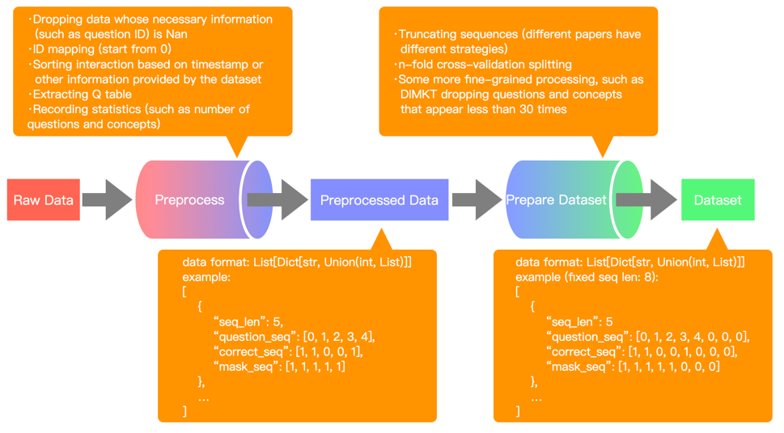

[Document] | [Datasets] | [Models] | [Experiement]

[Document]: md_doc/DOC.md
[Datasets]: md_doc/KT_DATASETS.md
[Models]: md_doc/MODELS.md
[Experiement]: md_doc/Experiement.md
# Introduction

This algorithm library was developed inspired by `pyKT` (the code repository corresponding to the paper [`"pyKT: A Python Library to Benchmark Deep Learning based Knowledge Tracing Models", NeurIPS 2022`](https://proceedings.neurips.cc/paper_files/paper/2022/hash/75ca2b23d9794f02a92449af65a57556-Abstract-Datasets_and_Benchmarks.html)). `pyKT` provides great convenience to researchers in the field of `Knowledge Tracing` and has made outstanding contributions to the development of `Knowledge Tracing`. However, we believe that `pyKT` also has some shortcomings, so we opened this algorithm library, named `DLKT`, to achieve complementary effects with `pyKT`.

- The Comparison with `pyKT`

|                           Content                            | DLKT  | pyKT  |
| :----------------------------------------------------------: | ----- | ----- |
| Arbitrary Experimental Settings (Data Processing, Dataset  Partitioning, ...) | True  | False |
| Mainstream Knowledge Tracing Model (DKT, DKVMN, AKT, LPKT, ...) | True  | True  |
|     Knowledge Tracing Model  Training Based on Concepts      | True  | True  |
|     Knowledge Tracing Model Training Based on Questions      | True  | True  |
|    Knowledge Tracing Model  Evaluating Based on Concepts     | True  | True  |
|    Knowledge Tracing Model  Evaluating Based on Questions    | True  | True  |
| Fine-grained Metrics (Cold Start, Long Tail, Biased and Unbiased Evaluation...) | True  | False |
| Knowledge Tracing Model Training Similar to Sequential Recommendation System | True  | False |
|                   Cognitive Diagnosis Task                   | True  | False |
|                            Wandb                             | False | True  |

- Data process pipline

<div align=center></div>

- note: The release branch has been refactored based on the main branch, and only the methods of published papers have been implemented, and unnecessary code has been deleted. Therefore, some of the features mentioned in the table above and the implementation of some methods mentioned in the `Models` document do not exist in the release branch. If you are interested in this part, please download the main branch code to view it.

# Quick-Start

## Prepare

1. Initialize project

   - Create file `settings.json` in the root directory.

   - Modify the environment configuration file `settings.json`

     ```python
     {
       "LIB_PATH": ".../dlkt-main",  # Change to the project root path
       "FILE_MANAGER_ROOT": "any_dir"  # Any path used to store data and models
     }
     ```

   - Run `set_up.py`

     ```shell
     python set_up.py
     ```

2. Place the original files of the dataset in the corresponding directory (Please refer to [Document (Section 1.3)](md_doc/DOC.md) for details)

3. Data Preprocessing: Run ` example/preprocess.py`, for example

   ```shell
   python preprocess.py --dataset_name assist2009
   ```

## Knowledge Tracing

1. Divide the dataset according to the specified experimental settings: Run `example/prepare_dataset/akt_setting.py`. For example, dividing the dataset according to the experimental setup of the AKT paper, i.e. 

   ```shell
   python akt_setting.py
   ```

   - For details on dataset partitioning, please refer to [Document (Section 1.6)](md_doc/DOC.md)

2. Train model: Run the file under `example/train`. For example, train a DKT model

   ```shell
   python dkt.py
   ```

   - Regarding the meaning of parameters, please refer to [Document (Section 2)](Doc.md)

## Cognitive Diagnosis

1. Divide the dataset according to the specified experimental settings: Run `example4cognitive_diagnosis/prepare_dataset/akt_setting.py`. For example, dividing the dataset according to the experimental setup of the AKT paper, i.e. 

   ```shell
   python ncd_setting.py
   ```

2. Train model: Run the file under `example4cognitive_diagnosis/train`. For example, train a NCD model

   ```shell
   python ncd.py
   ```

# Referrence

- [paper](md_doc/MODELS.md)

- [dataset](md_doc/KT_DATASETS.md)

# Contributing

Please let us know if you encounter a bug or have any suggestions by [filing an issue](https://github.com/ZhijieXiong/dlkt/issuesWe) 

We welcome all contributions from bug fixes to new features and extensions.

We expect all contributions discussed in the issue tracker and going through PRs.

# Contributors

- https://github.com/ZhijieXiong
- https://github.com/kingofpop625
- https://github.com/shshen-closer
