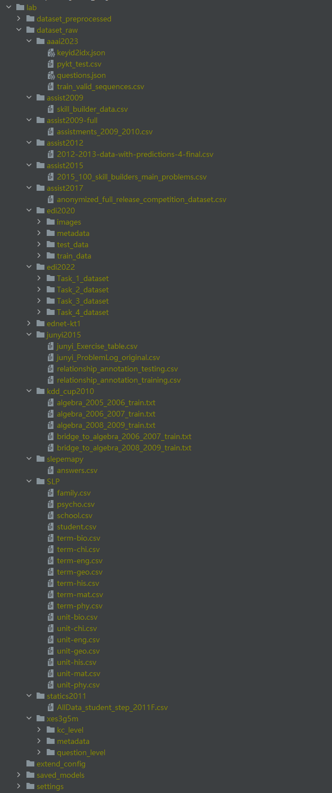
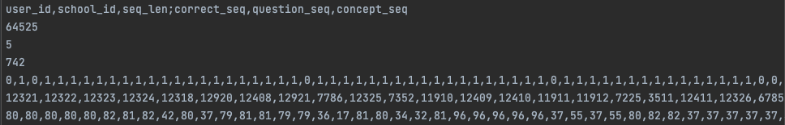

- [一、数据](#一数据)
  - [1、数据格式](#1数据格式)
  - [2、数据集信息](#2数据集信息)
  - [3、初始化项目](#3初始化项目)
  - [4、预处理生成的文件](#4预处理生成的文件)
  - [5、数据处理](#5数据处理)
  - [6、提供的实验设置](#6提供的实验设置)
- [二、训练模型](#二训练模型)
  - [1、基本介绍](#1基本介绍)
  - [2、通用参数](#2通用参数)
- [三、测试模型](#三测试模型)
  - [1、基本介绍](#1基本介绍-1)
  - [2、基于习题的测试](#2基于习题的测试)
  - [3、细粒度测试](#3细粒度测试)
- [四、其它](#四其它)
  - [1、自动生成脚本](#1自动生成脚本)
  - [2、自动处理结果](#2自动处理结果)
- [五、加入自己的数据和模型](#五加入自己的数据和模型)
  - [1、添加自己的数据](#1添加自己的数据)
  - [2、添加自己的模型](#2添加自己的模型)


# 一、数据

## 1、数据格式

|                     | multi_concept | single_concept | only_question |
| ------------------- | ------------- | -------------- | ------------- |
| 单知识点数据集      | no            | yes            | no            |
| 多知识点数据集      | yes           | yes            | yes           |
| 无知识点/习题数据集 | no            | no             | ye            |

- `multi_concept` 对于多知识点数据集，将一道多知识点习题拆成多个单知识习题
- `single_concept` 对于单知识点数据集，即习题序列和知识点序列一一对应；对于多知识点数据集，将多知识点组合视为新知识点，则数据集转换为单知识点数据集
- `only_question` 只有习题序列，对于无知识点或者无习题数据集，都将其视为习题序列
- 为什么要处理为多种数据格式？
  - 有些方法（原论文提供的代码）默认习题和知识点是一一对应的，如`AKT`、`DIMKT`，这些方法需要处理为`multi_concept`或者`single_concept`
  - 有些方法对于多知识点习题，是将其多个对应知识点的embedding取平均，然后和习题embedding一起送入encoder，如`IEKT`和`AKT table 6`，或者直接基于习题进行训练和预测，如`LPKT`和`LBKT`，这些方法就需要处理为`only_question`数据格式
  - 有些方法在预处理时将`multi_concept`数据转换为`single_concept`，如`CL4KT`

## 2、数据集信息

- 单知识点数据集：`assist2012` `assist2017` `edi2020` `SLP` `slepemapy` `statics2011` `junyi2015`

  - `SLP`是一系列数据集，包括`SLP-[mat|his|geo|bio|eng|phy|chi]`
  - `edi2020`是一系列数据集，包括`edi2020-task[1|34]`
  - `edi2020`和`statics2011`是层级知识点，且最低一级都是单知识点。只使用最细粒度的知识点，所以算单知识点数据集
  - 单知识点数据只会生成预处理数据：`data_single_concept.txt`

- 多知识点数据集：`assist2009` `assist2009-full` `ednet-kt1` `xes3g5m` `kdd cup2010`

  - `kdd cup2010`是一系列数据集，包括`algebra[2005|2006|2008]`和`bridge2algebra[2006|2008]`

  - `assist2009-full`是`assist2009`的完整版本，数据量更大

  - 对于多知识点数据集，会生成3种预处理数据：`data_multi_concept.txt`、`data_single_concept.txt`和`data_only_question.txt`

  - 注意：`xes3g5m`的知识点是层级的，但是最细粒度的知识点是多个的，所以当成多知识点数据集处理。`xes3g5m`的一个例子

    ```
    习题1035
    在question metadata中对应的kc_routes为
    [
      '拓展思维----应用题模块----年龄问题----年龄问题基本关系----年龄差', 
      '能力----运算求解',
      '课内题型----综合与实践----应用题----倍数问题----已知两量之间倍数关系和两量之差，求两个量',
      '学习能力----七大能力----运算求解',
      '拓展思维----应用题模块----年龄问题----年龄问题基本关系----年龄问题基本关系和差问题',
      '课内知识点----数与运算----数的运算的实际应用（应用题）----整数的简单实际问题----除法的实际应用',
      '知识点----应用题----和差倍应用题----已知两量之间倍数关系和两量之差，求两个量',
      '知识点----数的运算----估算与简单应用----整数的简单实际问题----除法的实际应用'
    ]
    在数据中对应的知识点为[169, 177, 239, 200, 73]，其对应的知识点名称为[
      '除法的实际应用', 
      '已知两量之间倍数关系和两量之差，求两个量', 
      '年龄差', 
      '年龄问题基本关系和差问题', 
      '运算求解'
    ]
    ```

- 无知识点/习题数据集：`assist2015` `poj`

  - 无知识点/习题数据只会生成预处理数据：`data_only_question.txt`


## 3、初始化项目

- 按照`README.md`中`Quick-Start`操作，生成的目录结构如下，原始数据放到 `lab/dataset_raw` 下

  <div align=center></div>

- `ednet-kt1`因为原始数据文件太多，所以先使用`exampe/concat_ednet.py`将每5000名学生的记录合成一个文件（通常情况下做`ednet-kt1`的实验也是随机选5000名学生的记录），合成后的文件会放到`dataset_raw/ednet-kt1`下，其目录为：

  <div align=center></div>

- 运行 `example/preprocess`处理指定数据集（即`dataset_preprocessed`下的目录名），生成的数据在 `lab/dataset_preprocessed`

## 4、预处理生成的文件

以`assist2009`（多知识点数据集）为例，生成的预处理文件如下

<div align=center></div>

- `concpet_id_map_[data_type].csv` ：知识点id映射文件，包括以下字段

  - `concept_id` 原始文件中知识点的id，为整数。注意：如果是原始文件中知识点id是数字，就和原始文件一样；如果不是数字，就先映射为整数再做预处理
  - `concept_mapped_id` 处理后的数据中知识点的id，从0开始

- `question_id_map_[data_type].csv` ：习题id映射文件，同`concpet_id_map_[data_type].csv` 

- `statics_preprocessed_[data_type].json`：不同数据格式的预处理数据对应的统计信息

  - `assist2009`的`statics_preprocessed_multi_concept.json`如下

    ```json
    {
      "num_interaction": 338001,
      "num_user": 4163,
      "num_concept": 123,
      "num_question": 17751,
      "num_school": 75,
      "num_max_concept": 4  // 每道题对应知识点数目最大值，即一道题对应最多4个知识点
    }
    ```

  - `assist2009`的`statics_preprocessed_single_concept.json`如下

    ```json
    {
      "num_interaction": 283105,
      "num_user": 4163,
      "num_concept": 149,  // 将多知识点组合视为新知识点，所以知识点数量变大
      "num_question": 17751,
      "num_school": 75
    }
    ```

- `data_[data_type].txt` 对应数据类型的预处理数据

  - 第一行数据是所有信息，分成两类，用`;`分隔
  - 前面的是学生/序列的属性，如学生id，序列长度，学生学校id
  - 后面的是序列的id，如`question_seq`表示学生做题的习题序列，`concept_seq`表示学生做题对应的知识点序列，`correct_seq`表示学生做题的结果序列（0或1表示错误或正确），`time_seq`表示学生做题的时间戳序列，`use_time_seq`表示学生做题所用时间序列
  - `multi_concept` 其中`question_seq`里的-1表示当前知识点和前一知识点对应同一习题

  <div align=center></div>

  - `single_concept` 因为都是单知识点，所以`question_seq`中不会出现-1

  <div align=center></div>

  - `only_question` 只有习题序列，所以序列长度比`multi_concept`短

  <div align=center></div>


- `Q_table_[data_type].npy`
  - Q*K的矩阵，其中Q是习题数量，K是知识点数量，`[q,k]==1`表示习题q对应知识点k
  - `multi_concept`和`only_question`对应的Q table为`Q_table_multi_concept.npy`，如`assist2009`中`Q=17751, K=123`
  - `single_concept`对应的Q table为`Q_table_single_concept.npy`，如`assist2009`中`Q=17751, K=149`

## 5、数据处理

- 数据处理分为两部分（或者三部分）
  - 数据预处理：对原始数据的处理。包括丢弃信息缺失的交互（如习题、知识点缺少的交互），习题和知识点id的重映射，时间信息（做题时间、做题耗时）等
  - 数据集划分处理：对预处理数据的处理，具体来说每篇论文的实验设置不一样，这一部分也就不一样。包括固定序列的长度、数据集的划分（训练集、验证集、测试集）等
  - 具体的实验设置：有些论文的实验设置比较特殊，需要单独处理。如`DIMKT`论文中会过滤掉出现次数小于30次的知识点和习题、`AKT`中对`assist2009`数据集的预处理是只保留有`skill_name`的知识点
- 整个数据处理的pipline如下

## 6、提供的实验设置

- 模版
  - 通用参数
    - `dataset_name` 数据集名字，即`lab/dataset_preprocessed`下的文件名
    - `setting_name` 在`lab/settings`下生成对应的文件夹，存放指定实验设置的数据
    - `data_type` 见`Section 1`
    - `max_seq_len` 固定序列最大长度，超过最大长度的则截断为多个子序列；不足最大长度的补0
    - `min_seq_len` 最小序列长度，首先从预处理数据中过滤掉低于最小序列长度的数据；截断超过最大序列长度的数据后再过滤一次
    - `n_fold` n折交叉验证
    - `test_radio` 测试集比例
    - `valid_radio` 验证集比例
    - `from_start` 是否从序列开始截断
  - `example/prepare_dataset/truncate2multi_seq_five_fold_1.py`
    - 超过最大长度的序列截断为多条序列
    - 首先随机划分训练集和测试集，然后对训练集使用n折划分，即n折训练集、n折验证集和一个测试集
  - `example/prepare_dataset/truncate2multi_seq_five_fold_2.py`
    - 超过最大长度的序列截断为多条序列
    - 首先对数据集集使用n折划分为训练集和测试集，然后对每折训练集随机划分验证集，即n折训练集、n折验证集、n折测试集
  - `truncate2one_seq_five_fold_1.py`
    - 超过最大长度的序列截断为多条序列，但是只保留最前面/最后面（由参数`from_start`控制）的一条子序列
    - 首先随机划分训练集和测试集，然后对训练集使用n折划分，即n折训练集、n折验证集和一个测试集
  - `truncate2one_seq_five_fold_2.py`
    - 超过最大长度的序列截断为多条序列，但是只保留最前面/最后面（由参数`from_start`控制）的一条子序列
    - 首先对数据集集使用n折划分为训练集和测试集，然后对每折训练集随机划分验证集，即n折训练集、n折验证集、n折测试集
- PYKT
- CL4KT
- DIMKT
  - 数据预处理
    1. 序列固定长度为100，大于该长度的序列截成多个子序列（视为新序列）
    2. 未提及序列最短长度，按常规设置，丢弃长度小于3的序列
    3. 丢弃出现次数小于30次的习题和知识点

  - 数据集划分
    - 五折交叉划分训练集和测试集，再在训练集划分20%数据作为验证集
- AKT
  - 数据预处理
    1. 序列固定长度为200，大于该长度的序列截成多个子序列（视为新序列）
    2. 未提及序列最短长度，按常规设置，丢弃长度小于3的序列
    3. 对于`assist2009`，丢弃没有`skill_name`的知识点
    4. 对于`assist2015`，`correct`字段如果不为0或1则丢弃

  - 数据集划分
    - 五折交叉划分训练集、验证集和测试集，占总数据集比例分别为60%、20%、20%
- LPKT
  - 数据预处理
    1. 序列固定长度为100（assist2015序列固定长度为500），大于该长度的序列截成多个子序列（视为新序列）
    2. 未提及序列最短长度，按常规设置，丢弃长度小于3的序列
  - 数据集划分
    - 五折交叉划分训练集和测试集，再在训练集划分20%数据作为验证集


# 二、训练模型

## 1、基本介绍

- `example/train`目录下的每一个文件都对应一个模型的训练代码，其中分为两类，原始KT模型和加载了其它方法的KT模型
  - 像`dkt.py`、`akt.py`等就是原始KT模型
  - 像`akt_instance_cl.py`、`qdkt_matual_enhance4long_tail.py`等就是加载了其它方法的KT模型，如`akt_instance_cl.py`表示使用了个体判别对比学习的`AKT`模型
- 训练全过程包括以下步骤
  - 配置全局参数和全局对象：配置代码在`example/train/config`下
  - 加载和处理数据：使用`lib/dataset`下的对应`Dataset`类加载数据
  - 训练模型：使用`lib/trainer`下的对应`Trainer`类训练模型

## 2、通用参数

- 数据集参数
  - `setting_name` 即`lab/settings`下的文件夹名
  - `dataset_name` 即`lab/dataset_preprocessed`下的文件夹名
  - `data_type` 见`Section 1`
  - `train_file_name` 训练集的文件名
  - `valid_file_name` 验证集的文件名
  - `test_file_name` 测试集的文件名
- 优化器参数
  - `optimizer_type` 优化器的类型，可选值为`"adam", "sgd"`
  - `weight_decay` 权重衰退
  - `momentum` SGD动量
- 训练策略参数
  - `train_strategy` 可选值为`"valid_test", "no_valid"`，前者表示使用验证集，后者表示没有验证集
  - `num_epoch` 训练的epoch数
  - `use_early_stop` 是否使用early stop策略，即在验证集上如果模型性能超过指定epoch数没有提升（判断的阈值是`0.001`），则停止训练
  - `epoch_early_stop` early stop策略中判断停止训练的epoch数
  - `use_last_average` 是否计算最后n个epoch模型的平均性能
  - `epoch_last_average` `use_last_average`中的n
- 评价指标参数
  - `main_metric` 用于选择模型的指标，可选值为`"AUC", "ACC", "RMSE", "MAE"`
  - `use_multi_metrics` 是否使用多个指标选择模型
  - `multi_metrics` 使用多个指标选择模型的规则，如`"[('AUC', 1), ('ACC', 1)]"`表示使用`AUC`和`ACC`一起选择模型，并且权重分别为1，即`AUC * 1 + ACC * 1`为选择指标
- 学习率参数
  - `learning_rate` 学习率
  - `enable_lr_schedule` 是否使用学习衰减
  - `lr_schedule_type` 学习率衰减策略，可选值为`"StepLR", "MultiStepLR"`
    - `StepLR` 相隔固定epoch数衰减一次学习率
    - `MultiStepLR` 在指定epoch上衰减学习率
  - `lr_schedule_step` 即`StepLR`的固定epoch数
  - `lr_schedule_milestones` 即`MultiStepLR`的指定epoch，如`"[5, 10]"`表示在第5和第10个epoch衰减学习率
  - `lr_schedule_gamma` 学习率衰减的幅度
- batch size参数
  - `train_batch_size` 训练batch size
  - `evaluate_batch_size` 测试batch size
- 梯度裁剪参数 
  - `enable_clip_grad` 是否使用梯度裁剪
  - `grad_clipped` 梯度裁剪的幅度
- 其它
  - `save_model` 是否保存模型，如果为`True`，模型会保存在`lab/save_models`下
  - `seed` 随机数种子
  - `trace_epoch` 是否追踪每个epoch下细粒度指标的变化

# 三、测试模型

## 1、基本介绍

- 测试代码：`example/evaluate.py`
- 参数说明
  - `save_model_dir` 保存模型参数文件和checkpoint的目录地址
  - `save_model_name` checkpoint文件名
  - `model_name_in_ckt` 如果没有修改lib里Trainer的代码，则对于"valid_test"模式训练的模型来说，默认是"best_valid"
  - `base_type` 如果选择"concept"，则是常规的测试，即序列每个时刻算一个样本；如果选择"question"，则请看本小节第2部分“基于习题第测试”
  - `statics_file_path` 由`example/prepare4fine_trained_evaluate.py`代码生成，是进行一些细粒度指标测试必须的信息，如果该文件没有，则不能进行"Long Tail"、"Question Bias"、"Double Bias"的细粒度测试
  - `max_seq_len` 序列固定的最大长度，和`test_file_name`的数据保持一致
  - `seq_len_absolute` 如"[0, 10, 100, 200]"表示测试模型在"[0, 10]"、"[10, 100]"、"[100, 200]"这三个长度区间上的性能
  - `previous_seq_len4bias` 控制Seq Bias测试的强度，即"Context Seq"的长度，该值越大，Bias越大
  - `seq_most_accuracy4bias` 控制Question Bias和Seq Bias测试的强度，即"Context Seq"正确率和"Question"在训练集中的正确率，该值越小，Bias越小
  - `transfer_head2zero` 默认False即可
  - `is_dimkt` 如果是DIMKT，需要习题和知识点难度index的信息
  - `train_diff_file_path` DIMKT训练时生成的文件
  - `num_question_diff` 和 `num_concept_diff` 和训练时保持一致，防止出现越界错误

## 2、基于习题的测试

- 由`pyKT`提出，用于测试多知识点数据集在`multi_concept`设置下的性能

## 3、细粒度测试

- 细粒度测试包括
  1. 基于序列长度评估（冷启动）
     - 将测试集序列按照位置划分，测试模型在序列不同长度位置上的性能
  2. 基于习题和知识点频率评估（长尾）
     - 首先根据训练集统计习题和知识点出现频率，在测试集上根据频率将习题和知识点划分为低频、中频和高频（对于习题来说，还有零频，即训练集中未出现过），然后评估模型在不同频段习题和知识点上的性能
  3. 基于习题和知识点正确率评估（数据偏差）
     - 首先根据训练集统计习题和知识点的正确率，在测试集上根据频率将习题和知识点划分低正确率、中等正确率和高正确率，然后评估模型在不同正确率水平习题和知识点上的性能
  4. 偏差冲突样本（或者可以认为是困难样本）评估
     - 首先从测试集中划分出有偏差（seq bias、question bias和double bias）的子集，然后测试模型在这个子集上的效果
     - seq bias：找出context seq accuracy（即历史正确率，如前10个时刻的做题正确率）高，但是做错习题的时刻，或者context seq accuracy低，但是做对的时刻
     - question bias：类似seq bias，在测试集中找出高正确率（训练集中计算出每道习题正确率）但是做错的样本，或者低正确率但是做对的习题的样本
  5. 偏差引导样本（或者可以认为是简单样本）评估：和偏差冲突样本评估相反，从测试集找出偏差引导样本（例如高正确率并且做对的习题）进行评测
  6. 基于习题偏差进行平衡采样后的评估
     - 来自论文`Do We Fully Understand Students' Knowledge States? Identifying and Mitigating Answer Bias in Knowledge Tracing`
     - 官方代码实现的是有重复的采样，我们有重复和无重复都实现了
- 按照以下步骤进行细粒度评估
  1. 运行`example/prepare4fine_trained_evaluate.py`生成细粒度测试所需要的文件`[train_data_name]_statics_common.json`和``[train_data_name]_statics_special.json``
  2. `statics_common`会提供习题和知识点在指定数据集上的正确率（如果某个习题或者知识点在数据集未出现过，则正确率为-1）
  3. 运行`example/evaluate.py`进行模型评估
  4. 如果没有第一步，则只能进行（1）基于序列长度评估和（2）基于seq bias评估（3）基于习题偏差进行平衡采样后的评估

# 四、其它

## 1、自动生成脚本

- 因为参数过多，在写shell脚本时比较麻烦，所以写了一个小工具，直接根据代码文件生成对应的shell脚本
- 工具代码：` auto_export_script.py `，各参数含义如下
  - `target_python_file` 想要生成脚本的训练代码文件（使用`argparse`接受参数），如`example/train/dkt.py`
  - `script_dir` 存放生成的shell脚本的文件夹

## 2、自动处理结果

- 解析训练日志文件，对多个结果取平均值，工具代码：` parse_result.py `

- 假设一份训练日志如下，是同一参数的模型在同一数据集（5折）下跑出来的结果，想计算在5折上测试集的平均结果，则设置参数

  - `file_path` 日志路径
  - `key_words` `"test performance by best valid epoch is main metric"`，用于定位从哪一行解析数据。设为该值则是计算5折下测试集（根据验证集选出来的最佳模型）性能平均值
  - `n` 5

  ```
  fold: 0
  ...
  train performance by best valid epoch is main metric: 0.82957  , AUC: 0.82957  , ACC: 0.78909  , RMSE: 0.38264  , MAE: 0.30218  , 
  valid performance by best valid epoch is main metric: 0.78778  , AUC: 0.78778  , ACC: 0.76575  , RMSE: 0.4016   , MAE: 0.31836  , 
  test performance by best valid epoch is main metric: 0.78986  , AUC: 0.78986  , ACC: 0.76307  , RMSE: 0.40327  , MAE: 0.32076  , 
  
  fold: 1
  ...
  train performance by best valid epoch is main metric: 0.83059  , AUC: 0.83059  , ACC: 0.78958  , RMSE: 0.38226  , MAE: 0.30111  , 
  valid performance by best valid epoch is main metric: 0.78966  , AUC: 0.78966  , ACC: 0.7634   , RMSE: 0.40328  , MAE: 0.32049  , 
  test performance by best valid epoch is main metric: 0.78705  , AUC: 0.78705  , ACC: 0.7653   , RMSE: 0.40204  , MAE: 0.31846  , 
  
  
  fold: 2
  ...
  train performance by best valid epoch is main metric: 0.82985  , AUC: 0.82985  , ACC: 0.78979  , RMSE: 0.38258  , MAE: 0.30337  , 
  valid performance by best valid epoch is main metric: 0.79009  , AUC: 0.79009  , ACC: 0.76466  , RMSE: 0.40252  , MAE: 0.32118  , 
  test performance by best valid epoch is main metric: 0.79002  , AUC: 0.79002  , ACC: 0.76625  , RMSE: 0.40116  , MAE: 0.31912  , 
  
  
  fold: 3
  ...
  train performance by best valid epoch is main metric: 0.82923  , AUC: 0.82923  , ACC: 0.78908  , RMSE: 0.38311  , MAE: 0.30516  , 
  valid performance by best valid epoch is main metric: 0.7895   , AUC: 0.7895   , ACC: 0.76412  , RMSE: 0.40272  , MAE: 0.32309  , 
  test performance by best valid epoch is main metric: 0.78946  , AUC: 0.78946  , ACC: 0.76614  , RMSE: 0.40156  , MAE: 0.32135  , 
  
  
  fold: 4
  ...
  train performance by best valid epoch is main metric: 0.82341  , AUC: 0.82341  , ACC: 0.78603  , RMSE: 0.38598  , MAE: 0.31031  , 
  valid performance by best valid epoch is main metric: 0.78841  , AUC: 0.78841  , ACC: 0.76316  , RMSE: 0.40364  , MAE: 0.32645  , 
  test performance by best valid epoch is main metric: 0.78818  , AUC: 0.78818  , ACC: 0.76245  , RMSE: 0.40349  , MAE: 0.32623  ,  
  ```

# 五、加入自己的数据和模型

## 1、添加自己的数据

- 必须的文件：` data_multi_concept.txt `，`data_single_concept.txt`，`data_only_question.txt`中任意一种格式，并有相对应的`Q_table_[data_type].npy`文件
- 将处理好的数据和文件放到`dataset_preprocessed/[your_dataset_name]/`文件夹下即可

## 2、添加自己的模型

- 第一步：写模型代码，放到`lib/model/`下
- 第三步：写训练配置代码，放到`example/train/config/`下
- 第四步：写训练启动代码，放到`example/train`下
- 第五步：修改`lib/util/load_model`，添加相对应的内容
- 可参考代码：建议参考`qDKT`模型，该模型使用的标准知识追踪数据集和训练器
